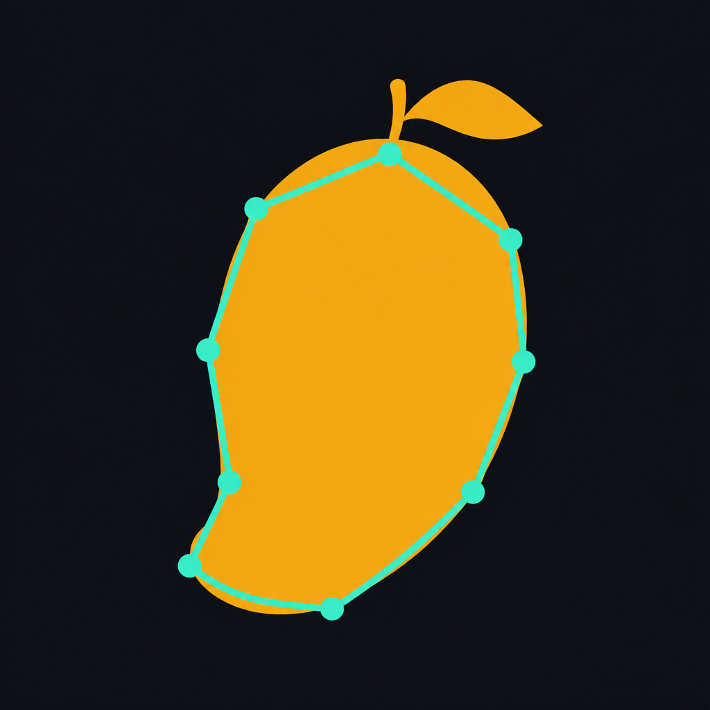

# Segriotate

<p align="center">
  
</p>

A local desktop app for **fruit grading** and **YOLO segmentation labelling**.

You open a folder of images, Segriotate pre-draws a polygon on every fruit your
trained model can see, and you grade those fruits (export, domestic, reject,
…) as you go. Anything the model misses, you click once and FastSAM (or
MobileSAM) fills in the mask. Labels are written as standard YOLO `.txt`
files on disk — nothing is uploaded.

## What it does

- **Auto-Detect** — runs your YOLO segmentation model (`segmentation.pt`) on
  each image as soon as it loads, and pre-fills polygons.
- **Click-to-Segment** — point-prompt fallback (FastSAM / MobileSAM / any
  other `.pt` or TensorRT `.engine` you drop in) for fruit the model missed.
- **Manual polygons** — draw by hand when neither model is right (`N`).
- **Grading classes** — assign one or more classes per fruit (`0–9`,
  `Shift+0–9` to add a second class). Types such as EXP / DOM / RET are
  UI groups only; YOLO files store subclass ids `0–9`.
- **Save** — writes YOLO segmentation `.txt` next to a paired labels folder.
  **Export ZIP** packs the current labels for backup or CVAT.

Everything runs on `127.0.0.1`. Images never leave the machine.

## How it works

```
python desktop_app.py   (or double-click Segriotate.app)
     |
     v
local Flask server starts on http://127.0.0.1:8765
     |
     v
your YOLO-seg model loads from models/dot-pt/segmentation.pt
     |
     v
Open Images…  →  labels saved to labels/<folder-name>-labels/
     |
     +--> Auto-Detect (ON)     →  polygons pre-filled
     |
     +--> model found it       →  fix class / nudge vertices if needed
     |
     +--> model missed it      →  Click-to-Segment on that fruit
     |
     +--> still not right      →  draw polygon by hand (N)
     |
     v
assign grading class (1–9, 0)
     |
     v
Save (S) / Auto-Save  →  YOLO .txt
     |
     v
next image (← →)
     |
     v
optional: scripts/03_split_dataset.py  then  scripts/04_train.py
```

`desktop_app.py` is a PyQt window around the same HTML editor. It starts
`scripts/segment_server.py` in the background:

| Endpoint | Role |
|---|---|
| `/detect` | YOLO `segmentation.pt` on the current image |
| `/segment` | click-to-segment with the selected `.pt` / `.engine` |
| `/label` | read/write YOLO `.txt` in the labels folder |
| `/media` | serve images from the folder you opened |

Click models load **lazily** on first click, from `models/dot-pt/` or
`models/dot-engine/`. `segmentation.pt` is the Auto-Detect model only; it is
not listed as a click model.

A batch alternative (`02_generate_labels.py` + CVAT) is included if you want
to process a whole set upfront instead of live, one image at a time.

## 1. Setup

```bash
python -m venv venv
source venv/bin/activate        # Windows: venv\Scripts\activate
pip install -r requirements.txt
```

Then put weights in place (next section) and start:

```bash
source venv/bin/activate
python desktop_app.py
```

Or double-click **`Segriotate.app`** (macOS) in this folder. First launch can
take a minute while `segmentation.pt` loads. Quit with Cmd+Q — that also
stops the local server.

Browser instead of the desktop window:

```bash
python scripts/segment_server.py
```

then open http://127.0.0.1:8765

## 2. Models — where they go and how to download them

Git does **not** include weights (they are gitignored). On first launch the
app downloads FastSAM and MobileSAM into `models/dot-pt/` in the background
while a spinner shows **Launching app. Please wait**. Files that already
exist are skipped.

```
models/
  dot-pt/          ← PyTorch .pt files (Mac, PC, Orin)
    segmentation.pt
    FastSAM-s.pt
    FastSAM-x.pt      (optional, larger / slower)
    mobile_sam.pt     (optional)
  dot-engine/      ← TensorRT .engine files (export on the Orin only)
```

### Auto-Detect (required for pre-filled polygons)

| File | Where | What it is |
|---|---|---|
| `models/dot-pt/segmentation.pt` | **your** trained YOLO-seg fruit model | Not a public download. Copy your `.pt` here, or set `SEGMENTATION_DOWNLOAD_URL` in `config.py`. |

The editor still opens without this file; Auto-Detect stays empty until you add it.

### Click-to-Segment (auto-downloaded)

These are fetched on first launch from Ultralytics if they are missing:

| File | Size | Download |
|---|---|---|
| `FastSAM-s.pt` | ~24 MB | https://github.com/ultralytics/assets/releases/download/v8.4.0/FastSAM-s.pt |
| `FastSAM-x.pt` | ~140 MB | https://github.com/ultralytics/assets/releases/download/v8.4.0/FastSAM-x.pt |
| `mobile_sam.pt` | ~40 MB | https://github.com/ultralytics/assets/releases/download/v8.4.0/mobile_sam.pt |

`FastSAM-s.pt` is the usual default (small and fast). `FastSAM-x.pt` is more
accurate and heavier. `mobile_sam.pt` is an alternative click model.

```bash
cd models/dot-pt

curl -L -O https://github.com/ultralytics/assets/releases/download/v8.4.0/FastSAM-s.pt
curl -L -O https://github.com/ultralytics/assets/releases/download/v8.4.0/FastSAM-x.pt
curl -L -O https://github.com/ultralytics/assets/releases/download/v8.4.0/mobile_sam.pt
```

Docs: [FastSAM](https://docs.ultralytics.com/models/fast-sam/),
[MobileSAM](https://docs.ultralytics.com/models/mobile-sam/). Original FastSAM
paper weights: [CASIA-IVA-Lab/FastSAM](https://github.com/CASIA-IVA-Lab/FastSAM).

In the editor, pick **Format** (`.pt` or `.engine`) then **Model**. Click
models are whatever files are in those folders; extra `.pt` files you add
will show up too.

### TensorRT (Orin only)

There is no download for `.engine` files. Export them **on the Jetson** from
the `.pt` weights (engines are tied to that GPU + JetPack). Copy the result
into `models/dot-engine/` with matching stems, e.g. `FastSAM-s.engine`.

### Training start weights (optional)

Only needed when you run `scripts/04_train.py`. Ultralytics can fetch this
on first train, or download it yourself:

| File | Download |
|---|---|
| `yolo11n-seg.pt` | https://github.com/ultralytics/assets/releases/download/v8.3.0/yolo11n-seg.pt |

Name is set in `config.py` as `TRAIN_BASE_MODEL`.

## 3. Using the editor

1. Start the app. Wait until the editor appears (not the splash screen).
2. **Open Images…** and pick a folder in the project (for example `img-1`).
   Labels go to `labels/img-1-labels/` automatically. Use **Labels Folder…**
   only to override that.
3. For each image:
   - **Auto-Detect: ON** (default) — your model pre-fills every object it
     finds as the image loads.
   - Fix a polygon: drag a vertex, double-click an edge to insert a point,
     right-click a vertex to delete it.
   - Press **1–9** or **0** to set the grading class on the selected
     polygon. **Shift+0–9** adds an extra class on the same fruit.
   - If a fruit was missed: keep **Click-to-Segment** on, click the fruit,
     then assign a class.
   - **N** draws a polygon by hand. **Enter** finishes it, **Esc** cancels.
   - **S** saves, **← / →** move to prev/next (auto-saving if Auto-Save is on).

Jump to an image by clicking the number in the header, typing, and pressing
Enter.

### Shortcuts

| Action | Key |
|---|---|
| Click fruit to segment | click |
| New polygon | `N` |
| Finish polygon | `Enter` |
| Cancel / deselect | `Esc` |
| Delete polygon | `Del` |
| Replace class 0–9 | `0…9` |
| Add extra class | `Shift+0…9` |
| Insert vertex | double-click edge |
| Delete vertex | right-click vertex |
| Pan | space + drag |
| Zoom | scroll |
| Prev / next image | `←` `→` |
| Save | `S` |
| Undo | `Ctrl+Z` / `Cmd+Z` |

## 4. Edit `config.py`

At minimum, check/set:

- `MIN_CONFIDENCE` / `AUTO_ACCEPT_CONFIDENCE` — how strict auto-accept is
  (used by the batch script; the live editor uses `MIN_CONFIDENCE` for detect)
- `FORCE_CLASS_ID` or `CLASS_MAP` — how old class ids map to your new classes
- `CLASS_NAMES` — names shown in the editor and written into `data.yaml`

Default subclasses (ids written to YOLO `.txt`):

| Id | Name | Type (UI group) |
|---|---|---|
| 0 | Export Premium | Export Quality (EXP) |
| 1 | Prime Export | Export Quality (EXP) |
| 2 | Domestic Premium | Domestic Premium (DOM) |
| 3 | Prime Retail | Domestic Premium (DOM) |
| 4 | Standard Retail | Retail Standard (RET) |
| 5 | Everyday Retail | Retail Standard (RET) |
| 6 | Commercial | Commercial (COM) |
| 7 | Value | Commercial (COM) |
| 8 | Processing | Non-Market (NMR) |
| 9 | Reject | Non-Market (NMR) |

## 5. Optional batch pipeline

Use this if you want a full-folder pass and CVAT review instead of live
grading.

```bash
python scripts/00_diagnose.py          # check the .pt is a seg model
python scripts/01_test_model.py --n 10 # sanity check on a handful of images
python scripts/02_generate_labels.py   # auto vs review buckets
python scripts/03_split_dataset.py     # train/val/test from labels/
python scripts/04_train.py             # fine-tune TRAIN_BASE_MODEL
```

`02_generate_labels.py` writes:

- `output/labels_auto/` — high confidence, ready to train
- `review/no_detection/` — model found nothing
- `review/low_confidence/` — at least one instance below `AUTO_ACCEPT_CONFIDENCE`
- `review/multiple_objects/` — crowded scenes (`MAX_INSTANCES_BEFORE_REVIEW`)

### CVAT

Better if several people review, or you want CVAT tools (magnetic lasso,
interpolation, etc). Use with the batch script, not the live editor:

1. Run `python scripts/02_generate_labels.py`.
2. In CVAT, create a task and upload `review/<bucket>/images/`.
3. Import **YOLO 1.1 Segmentation**, pointing at `review/<bucket>/labels/`
   (plus an `obj.names` file listing `CLASS_NAMES` in order).
4. Correct the masks, export as **YOLO 1.1 Segmentation**.
5. Copy the corrected `.txt` files into `output/labels_auto/`.

Then run `03_split_dataset.py`.

`03_split_dataset.py` looks for `.txt` files in `labels/` first, then falls
back to `output/labels_auto/`. If you labelled in the live editor, copy or
point it at `labels/<folder>-labels/` as needed.

## 6. Notes

- If your existing model's masks are roughly 90%+ accurate, this saves most
  of the annotation time. If they are well under 70%, it is usually faster
  to label a smaller seed set by hand, retrain, and re-run with the improved
  model.
- `CLASS_MAP` drops any class id not listed — add an identity entry
  (e.g. `4: 4`) for classes you want to keep unchanged.
- `.pt` files run on Mac / PC / Orin. `.engine` files must be built on the
  Orin; do not copy an engine from another machine.
- No data leaves your machine unless you self-host CVAT elsewhere.
